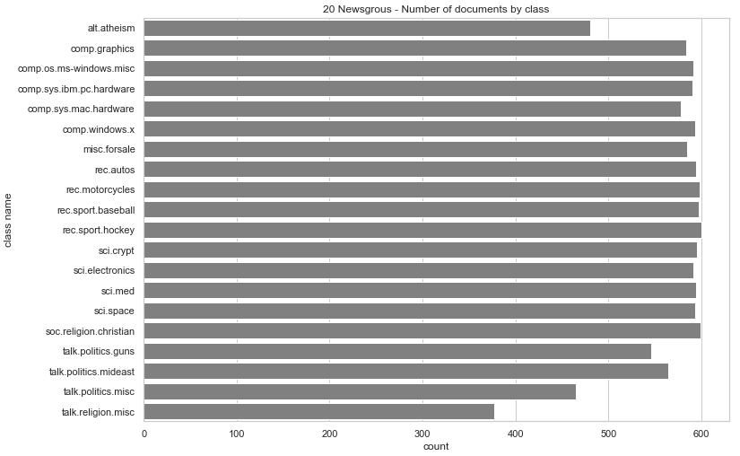
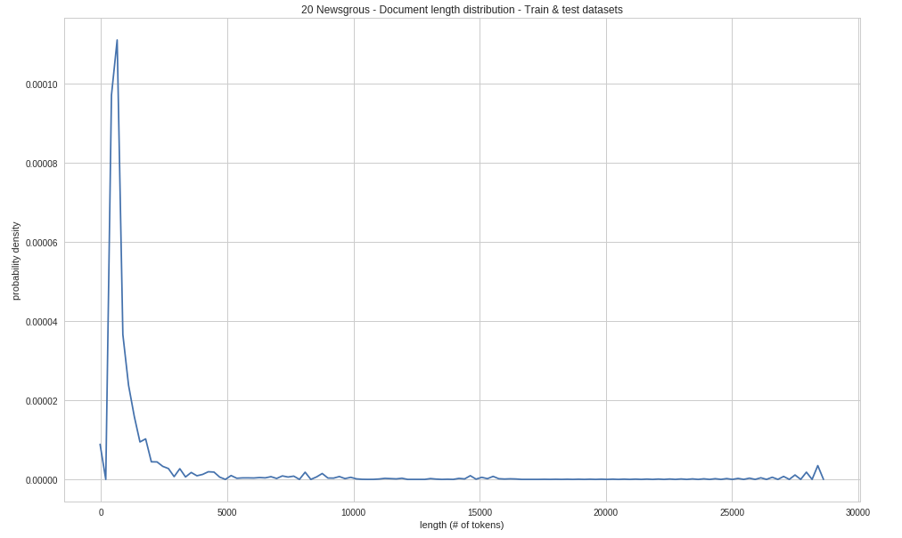
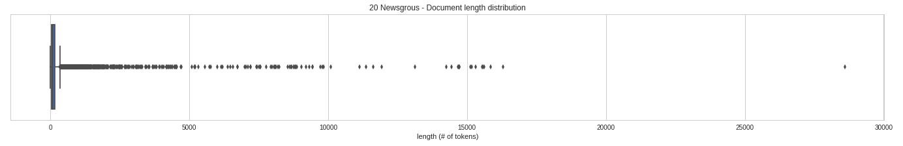
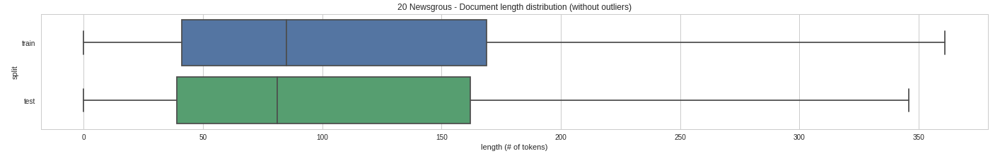
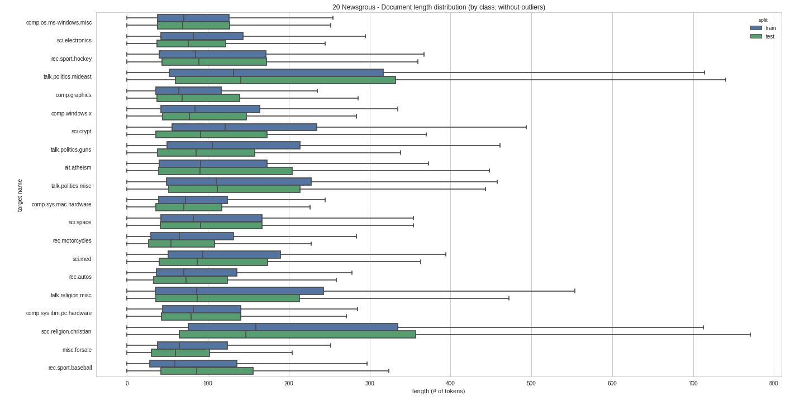
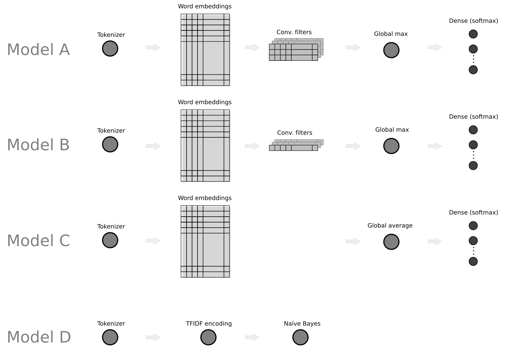
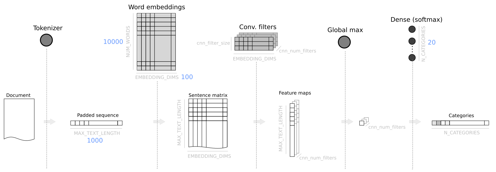
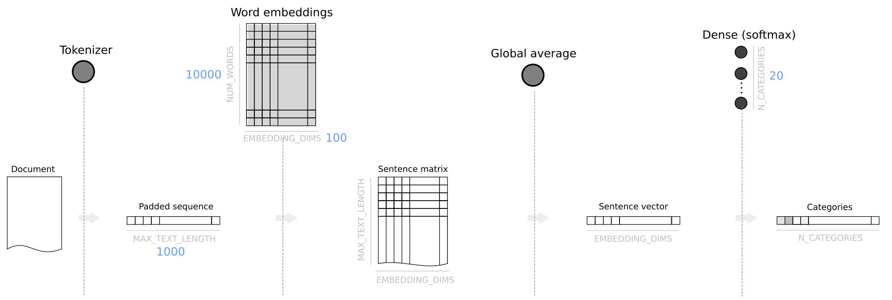
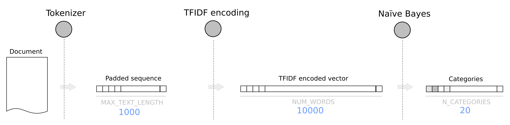

#Machine Learning Engineer Nanodegree
##Capstone Proposal

Álvaro Santamaría Herrero

December 2018

##Proposal

###Domain Background

Natural Language Processing (NLP) is the sub-field of AI (Artificial Intelligence) that is focused on enabling computers to understand and process human languages. Text classification is one of the tasks within the NLP domain, and it is about applying Machine Learning to assign a category to each document in a corpus. Traditionally, the task of classifying text with Machine Learning models has been carried out by applying non-deep-learning classifiers, e.g., very commonly Support Vector Machines and Naïve Bayes classifiers, and based on an approach that disregards text sequence structure and treats each document as a "bag of words". Each document is then encoded as a sparse vector in a high dimensional space, possibly using refinements in the encoding as TFIDF (Term Frequency Inverse Document Frequency). See [Provost and Fawcett2013], Chapter 10: Representing and Mining Text.

Newer methods for text classification in the context of NLP have been based on application of deep learning, i.e., deep neural networks. The most natural approach has been that of applying Recurrent Neural Networks (RNN), with further refined variants as Long Short-Term Memory (LSTM) and Gateway Recurrent Units (GRU) [Chollet2018]. These ones seemed most suited to the task as they deal naturally with the input as a sequence. However, recent experiments have shown that another variant of neural networks, Convolutional Neural Nets (CNN), which have been applied with success to image classification, have shown promising results for text classification with relatively simple architectures. That's the case of [Kim2014], where a simple CNN is applied to obtain state-of-the-art scores on different datasets. Related research followed this paper and in [Zhang and Wallace2016] the authors compile the research so far and try to give a set of guidelines for practitioners to fine-tune the multiple parameters involved in such a CNN architecture. In this project we will use this document as a reference and guide to build our own text CNN-based classifier.

On the other hand, these methods for text classification based on neural networks, both RNN and CNN, require each document to be encoded not as a single vector that represents a whole document (like in the mentioned TFIDF approach) but as a sequence of vectors, each one representing a word or token. The simplest approach is to encode each word as a sparse, high-dimensional one-hot vector. However, current solutions try to transform that high-dimensional, inefficient encoding into a dense, low-dimensional space which in turn tries to encode semantic meaning in the distances and angles between vectors. These representations for text tokens are called "word embeddings". See [Chollet2018], Chapter 6: Deep learning for text and sequences. The most representative and currently used word embeddings are [word2vec](https://code.google.com/archive/p/word2vec/) and GloVe (Global Vectors for word representation) [Pennington et al.2014]. In the context of this project we will resort to the latter.

As for the types of dataset on which text classification techniques are applied, it's interesting to note that the most studied case is sentiment analysis, when a label of value positive or negative (and possibly neutral too) is assigned to each document. However, the experiments with multi-class datasets are less common. As an example, see the cited paper [Zhang and Wallace2016] where 9 datasets are used but only one (TREC) is a proper multi-class dataset. We find that there may be interesting multi-class text classification cases beyond sentiment analysis. E.g., posts in social networks where we would like to assign a political ideology or purchasing power to a user from the way they use the written language in such a context. In such example, we could target specific ad campaigns to selected groups of users. That would be something similar to the case of Facebook/Cambridge Analytica (see [Weapons of Micro Destruction: How Our ‘Likes’ Hijacked Democracy](https://towardsdatascience.com/weapons-of-micro-destruction-how-our-likes-hijacked-democracy-c9ab6fcd3d02) ) but using text posted by the users to the social network instead of their "likes". On top of all above, we find interesting to research how important in a text the information that can be extracted from the sequential structure (positional information) is, compared to the information that is available from the simple fact that a specific set of words are used. In many cases we may assume that most of the information is available simply from word presence, i.e., the vocabulary that is used. Thus, the question arises: is it worthy to try to extract additional information from text sequence structure when it means to resort to more complex and resource-expensive models?

###Problem Statement

We want to apply a relatively simple convolutional neural net (CNN) as described in the recent cited papers ([Kim2014], [Zhang and Wallace2016]) to the supervised problem of multi-class text classification. Allegedly, CNNs can extract patterns from the sequential structure of text and use this to improve classification scores. 

In addition, we want to analyse and reflect on how much of the performance of the CNN-based classifier can be attributed to exploiting the sequential structure of the text in comparison to the selection of the vocabulary (set of words). In other words, we will try to quantify how important sequential information is in comparison with information that is also present in the text but is not positionally encoded. 

Be aware that the potential amount of information that is positionally encoded in the text depends on the type of dataset and its label set. Note also that when we refer to "information" we mean information that is relevant to the specific classification task we are dealing with. 

We believe our approach is interesting at least for the following two reasons:

- Text classification studies for multi-class data sets are not that common.
- As presented in the references above, it is assumed that CNNs can work well for classifying text as they can potentially extract sequential patterns from text (as RNN do), but the reference studies do not try to quantify what's the importance of this positional information in the overall performance of the model. 

###Datasets and Inputs

We will use a single multi-class dataset: [20 Newsgroups](http://qwone.com/%7Ejason/20Newsgroups/). The "20 newsgroups" dataset comprises around 18000 newsgroups posts on 20 topics split in two subsets: one for training (or development) and the other one for testing (or for performance evaluation). The split between the train and test set is based upon messages posted before and after a specific date. The test split accounts for approximately the 40% of the dataset.

The dataset can be directly imported from the [scikit-learn](http://scikit-learn.org/0.19/index.html) library.

```
from sklearn.datasets import fetch_20newsgroups
raw_data_train = fetch_20newsgroups(subset='train', random_state = 42)
raw_data_test = fetch_20newsgroups(subset='test', random_state = 42)
```
Number of documents, as imported from `scikit-learn`:

|Total| Training | Test|
|---  |---       |---  |
|18846| 11314    |7532 |

####Classes

The 20 labels (newsgroups) are the following:

```
raw_data_train.target_names
Out[48]: 
['alt.atheism',
 'comp.graphics',
 'comp.os.ms-windows.misc',
 'comp.sys.ibm.pc.hardware',
 'comp.sys.mac.hardware',
 'comp.windows.x',
 'misc.forsale',
 'rec.autos',
 'rec.motorcycles',
 'rec.sport.baseball',
 'rec.sport.hockey',
 'sci.crypt',
 'sci.electronics',
 'sci.med',
 'sci.space',
 'soc.religion.christian',
 'talk.politics.guns',
 'talk.politics.mideast',
 'talk.politics.misc',
 'talk.religion.misc']
```

As the reference above points out: 

> Some of the newsgroups are very closely related to each other (e.g. comp.sys.ibm.pc.hardware / comp.sys.mac.hardware), while others are highly unrelated (e.g misc.forsale / soc.religion.christian). Here is a list of the 20 newsgroups, partitioned (more or less) according to subject matter: [...]

Group A:

* comp.graphics
* comp.os.ms-windows.misc
* comp.sys.ibm.pc.hardware
* comp.sys.mac.hardware
* comp.windows.x

Group B:

* rec.autos
* rec.motorcycles
* rec.sport.baseball
* rec.sport.hockey

Group C:

* sci.crypt
* sci.electronics
* sci.med
* sci.space

Group D:

* misc.forsale

Group E: 

* talk.politics.misc
* talk.politics.guns
* talk.politics.mideast

Group F:

* talk.religion.misc
* alt.atheism
* soc.religion.christian

The split of documents by class is the following for the training set: 

```
classes_summary
Out[155]: 
                  class name  count
1                alt.atheism    480
2              comp.graphics    584
3    comp.os.ms-windows.misc    591
4   comp.sys.ibm.pc.hardware    590
5      comp.sys.mac.hardware    578
6             comp.windows.x    593
7               misc.forsale    585
8                  rec.autos    594
9            rec.motorcycles    598
10         rec.sport.baseball    597
11          rec.sport.hockey    600
12                 sci.crypt    595
13           sci.electronics    591
14                   sci.med    594
15                 sci.space    593
16    soc.religion.christian    599
17        talk.politics.guns    546
18     talk.politics.mideast    564
19        talk.politics.misc    465
20        talk.religion.misc    377
```



According to the previous distribution of classes, the **entropy of the dataset** (training split) is **4.314 bits**. 
Where entropy is defined as: 

$$ H = - \sum_{i=1}^{20}  p_i \log_2(p_i) $$

where $$ p_i $$ is the proportion or relative frequency of each class in the dataset. The entropy for a perfectly balanced dataset of 20 classes would be 4.322, less than 0.2% away from our dataset's, thus we can say we have a fairly balanced dataset in terms of class distribution.

####Document structure

The content of the documents is that of an e-mail. Thus, in addition to the body of the message, we have additional header fields, possibly footers, and also inline quotes. As pointed out in the [scikit-learn documentation](https://scikit-learn.org/stable/documentation.html), all of them, headers, footers and quotes,  make the classifier to easily overfit. For that reason, we will remove them. Quote from scikit-learn documentation:

> When evaluating text classifiers on the 20 Newsgroups data, you should strip newsgroup-related metadata. In scikit-learn, you can do this by setting remove=('headers', 'footers', 'quotes'). The F-score will be lower because it is more realistic.

Here there is an example from the training set, index=201:

```
From: mwbg9715@uxa.cso.uiuc.edu (Mark Wayne Blunier)
Subject: Re: 5W30, 10W40, or 20W50
Organization: University of Illinois at Urbana
Lines: 12

zowie@daedalus.stanford.edu (Craig "Powderkeg" DeForest) writes:

>If you're planning on making long drives, the 20W50 is probably fine
>(esp. in the summer) in your 10W40 car.  But if you're making short drives,
>stick to the 10W40.

Several years ago GM was having trouble with the rings sticking on the
5.7 diesel.  They traced a cause to the use of 10W-40 oil.  They would
not honor warranty work if 10W-40 was used (if my memory serves me).
5-30, 10-30 or 20 50 was OK'd though.

Mark B.
```
And the same document after removing headers, footers and quotes:

```
Several years ago GM was having trouble with the rings sticking on the
5.7 diesel.  They traced a cause to the use of 10W-40 oil.  They would
not honor warranty work if 10W-40 was used (if my memory serves me).
5-30, 10-30 or 20 50 was OK'd though.
```

####Text length distribution

The text length distributions, measured in number of words (tokens as split by keras tokenizer), is as follows:

For the training set:

```
count    11314.000000
mean       210.552236
std        778.535062
min          0.000000
25%         41.000000
50%         85.000000
75%        169.000000
max      16306.000000
```

Test set:

```
count     7532.000000
mean       179.106346
std        583.172570
min          0.000000
25%         39.000000
50%         81.000000
75%        162.000000
max      28592.000000
```

Combined set (training and test):

```
count    18846.000000
mean       197.984559
std        707.113941
min          0.000000
25%         40.000000
50%         83.000000
75%        167.000000
max      28592.000000
```

The distribution for the total dataset (training and test) looks like this:









The dataset is used as a well-known example of multi-class classification, with a fairly high number of classes (20). Classes are pretty balanced and document lengths vary a lot, from empty documents to 28592 tokens, aprox. mean of 198 tokens, and a large standard deviation of 707 tokens. Along the project we will consider a maximum length to truncate the documents so that they retain enough information for the classification purpose but they do not overload the expensive computation that requires to train the CNN. Just as a hint only 2.4% of the documents of the training dataset are longer than 1000 tokens.

###Solution statement, benchmark models and evaluation metrics

We will apply a variation of the convolutional-single-layered type of CNN proposed in [Kim2014] and [Zhang and Wallace2016]. We will label this as "Model A", which is made up of the following layers, in order: embeddings, convolutional layer (of single filter size), max pool layer, and finally a densely connected layer of 20 nodes. We will train this model and search for best hyper-parameters. Then we will evaluate how good this model is for the classification task on the 20 newsgroups dataset. Then, in order to explore and try to assess how much information relevant to the classification task is extracted from the positional information of the text sequences, we will build and train two more models, based on modifying the original one:

- "Model B". It has the same components and layers of "Model A", but the filters' size of the convolutional layer is set to 1. This way, the convolutional scan won't be able to extract sequential patterns from the text.
- "Model C". We remove the convolutional and max-pool layer from "Model A" and substitute them for a layer that calculates the average vector of the vector sequence that represents a document. This way we also eliminate any mechanism that could extract information from the word position in the sequence.

Finally, as a benchmark model, we will build "Model D", which will tackle the task of classifying the dataset by using TFIDF (Term Frequency Inverse Document Frequency) representation of the documents and a Multinomial Naïve Bayes classifier.

The following table and diagram summarise the models described above with their respective layers.

|Model|          |	        |			    |        |     |
|---  |---       |---       |---         |---     |---  |
|A    |Tokenizer |Embeddings|CNN Layer   |Max Pool|Dense|
|B    |Tokenizer |Embeddings|CNN Layer(1)|Max Pool|Dense|
|C    |Tokenizer |Embeddings|Average     |Dense   |     |
|D    |Tokenizer |TFIDF     |Naïve Bayes |        |     |



We will assess the performance of all the models by calculating and comparing **accuracies**.

$$ Accuracy = {TP + TN \over N} $$

Where TP is the number of true positives in the confusion matrix, TN the number of true negatives, and N the total number of samples in the test split of the dataset.

In order to quantify how much relevant information can we additionally extract between models, we will resort to calculate the **information gain**. This magnitude, expressed in bits, will tell us how much more relevant information can a (better) model extract in comparison to another one. Following the design of the models as explained above, we know that the only model that can extract positional information from text sequences is "Model A", while both "Model B" and "Model C" can't. Thus, we will be able to estimate how good is "Model A" in extracting such additional positional information.

In order to calculate the information gain between two models, we need to calculate first the **entropy** of the confusion matrices that result from applying the trained classifiers to the test dataset. The expression of the entropy (H) for a set of samples that are classified with the same label is:

$$ H(X|y \in Y) = - \sum_{x \in X} p(x|y) \log_2 p(x|y) $$

Where $$ X = \{ x_1, x_2, ..., x_N\} $$ is the set of labels (i.e., how the documents are labeled after classification) and Y the set of real classes the documents belong to. And $$ p(x|y) $$ is the conditional probability that a document assigned to class *y* after classification belongs to class *x*.

The resulting entropy for the complete dataset after classification is the weighted average of the entropies for each label:

$$ H(X) = \sum_{y \in Y} p(y) \space H(X|y) $$

Finally, the **information gain** is calculated by subtracting the entropies of the resulting classification for two different models.

$$ IG(A,B) = H_B(X) - H_A(X) $$

Where $$ IG(A,B) $$ is the information gain that model A gives over model B.

See [Provost and Fawcett2013], chap. 3, where this definition of information gain is presented.

Alternatively, we can calculate the **mutual information** between predicted labels and real classes. (See [Mutual Information, Wikipedia](https://en.wikipedia.org/wiki/Mutual_information)):

$$ I(X;Y) = \sum_{x \in X} \sum_{y \in Y} p(x,y) \log_2 \Big( {p(x,y) \over  p(x)p(y)} \Big) $$

###Project Design

####Tools and libraries

We will use Python 3 and two main libraries:

* [Keras](https://keras.io/), to train the neural network models and also for pre-processing (e.g., tokenizer).
* [Scikit-Learn](https://scikit-learn.org/stable/), mainly to load the "20 newsgroups" dataset and for the baseline model (Naïve Bayes) plus possibly some of its utilities.

Due to the high demand of processing resources associated to training deep neural networks, we will write and execute our code in [Google Colab](https://colab.research.google.com), using a notebook connected a GPU-enabled python kernel.

####Description of the models

As mentioned, we will evaluate 4 different models.

#####Model A


The first layer of **Model A** is a tokenizer, which converts each text document into sequences of integers, where each number represents a word in a dictionary that contains all the words that are present in the corpus of documents. The next layer, embeddings, converts each number in a sequence into a dense vector of 100 dimensions. The output is then a sequence matrix, which has as many rows as tokens in the document, and as many columns as dimensions in the embedded representation. Then a convolutional layer of dimension 1 is applied to the sequence matrix. The size of the filters will be the main hyper-parameter to explore, from 2 to 10, trying to detect which size is able to achieve a better classification. We will also explore the best number of filters to use in this convolutional layer. The outcome of this stage is a set of feature maps, one per filter, each one being a sequence of values with same length as the original text sequences. After that, a global max. pooling layer reduces each feature map to a single value. These values are concatenated into a sequence of values of the same length as the number of filters used in the convolutional layer. Finally, a dense neural net layer of 20 nodes and with softmax activation function is applied to get the final array of 20 values which represent the probabilities of each one of the 20 categories of our classification task. 

In general, we will try to follow the guidelines for this type of CNN architecture from [Zhang and Wallace2016], as well as the starting values of hyper-parameters they recommend:

|Description        |Values          |
|---                |---             |
|input word vectors |Google word2vec |
|filter region size |(3,4,5)         |
|feature maps       |100             |
|activation function|ReLU            |
|pooling            |1-max pooling   |
|dropout rate       |0.5             |
|l2 norm constrained|3               |

However, we will slightly change the following:

* Instead of word2vec embeddings, we will use Glove.
* In [Zhang and Wallace2016] they propose 3 parallel channels in the convolutional layer, with 3 different consecutive filter sizes. We will simplify that architecture by using a single convolutional channel with a unique CNN filter size, and to compensate, we will multiply by 3 the number of feature maps as starting point when tuning hyper-parameters.

#####Model B

**Model B** is the result of modifying Model A by setting the convolutional filters' size to 1.

#####Model C



**Model C** is the result of modifying Model A by removing the convolutional layer and substituting the global max. pooling layer by a global average layer.

#####Model D



**Model D** is the baseline benchmark model, which is based on a Naïve Bayes classifier applied on a TFIDF (Term Frequency - Inverse Document Frequency) representation of each document. 

####Data Preparation

The dataset (20 newsgroups) will be loaded by using the utility function `fetch_20newsgroups` provided by the scikit-learn library, both for the training and test splits of the dataset. As described above when analysing the dataset, we will remove headers, footers and quotes by specifying the value `remove` of the `fetch_20newsgroups` function:

```
dataset_train = fetch_20newsgroups(subset='train',
                                    random_state=42,
                                    remove=('headers', 'footers', 'quotes'))
```
The next step will be tokenising the texts. For that we will use the `Tokenizer` class in the Keras library. In the tokenising process we will consider only the 10000 more common words in the dataset. Then, we will build several matrices that will work as input and target outputs for our models:

* `X_tfidf_train`. Each row in this matrix represents a document in the training dataset split, encoded with the TFIDF method. Each column represents a word in the set of 10000 more common words in the dataset.
* `X_tfidf_test`. Same as above but for the test dataset.
* `X_seqs_train`. Each row represents a document in the training dataset split, encoded as a sequence of integers (each value corresponds to a word in the set of more common 10000 words). In order to have constant length rows, these sequences are padded with zeros on the left, and truncated to the maximum length of 1000 words.
* `X_tfidf_test`. Same as above but for the test dataset.
* `Y_train`. Matrix that represents the labels (classes) for each document in the training dataset.
* `Y_test`. Same as above bot fur the test dataset.
* `Y_1hot_train`, `Y_1hot_test`. 1 hot encoding representation of both label matrices above, needed for calculating categorical cross-entropy in the neural network models.

####Word embeddings layer

We will download the Glove pre-trained word vectors ([Pennington et al.2014]) from [GloVe: Global Vectors for Word Representation](https://nlp.stanford.edu/projects/glove/) web page: Wikipedia 2014 + Gigaword 5 (6B tokens, 400K vocab, uncased, 50d, 100d, 200d, & 300d vectors, 822 MB download). 
We will take the representation of the vectors that use 100 dimensions and build an embedding matrix that we will be able to pre-load in our neural network models.

####Training Model A

The next step will be to start training Model A as described above. For achieving that we will carry out a grid search in several steps. 

1. First, we will try to find the best hyper-parameter values for batch size and type of optimiser, leaving the rest of hyper-parameters fixed to the values suggested as starting point in [Zhang and Wallace2016]. 
2. Then, we will fix the best values we found for batch size and optimiser type and will explore the effect of preloading the embedding layer with the GloVe word vectors, and if the weights of the embedding layer are to be optimised during training or left as they have been pre-loaded. 
3. After that, we will explore both the convolutional filter size and the number of filters in the convolutional layer. Our plan is to scan values from 2 to 10 as convolutional filter size, and try number of filters in {50, 100, 300, 600, 900}

After this process we should have a final selection of hyper-parameters for our classification task. We will train our model one final time with these to get and save the best weights for Model A. We will then evaluate the model by calculating the accuracy of Model A on the test set.

####Training Model B

We will build Model B by re-using all the hyper-parameters from Model A, except for the convolutional filter size, which will be fixed to 1. As commented, we want to force the new model not to be able to extract positional information from the text sequences. Again, we will train it and get and save the best weights for Model B and evaluate it by calculating the accuracy on the test set.

####Training Model C

In a similar way, we will create a new instance of a neural network, but this time we modify Model A by removing the convolutional layer and will substitute the global max pooling layer with a global average pooling layer. Again, we will re-use the best hyper-parameters we found for Model A. We will train Model C to get and save its best weights, and then we will evaluate it by calculating its accuracy on the test set.

####Training Model D

Finally, we will train the benchmark model, a Naïve Bayes classifier applied on the TFIDF representation of the documents. We will evaluate it by calculating the accuracy on the test set.

####Evaluation of models and information gain

Once we've trained all the models (A, B, C, D) we will evaluate and compare their scores. As mentioned, we should have already calculated accuracies on the test set for all of them.

Then, we will calculate and represent the confusion matrix on the test set for each of them. From the confusion matrices, and as explained before, we can calculate the entropy of each of them. Calculating differences between entropies we can obtain the information gain we obtain between models for the classification task we have at hand.

####Analysis

Based on the accuracies and especially on the information gain, we will want to assess how good the model it to extract positional information from the text sequences, information which is in turn useful for the very specific classification task we are analysing. We will also try to get some insights about the impact of different components into the overall performance of the model. And more generally, we will try to reflect on what's the influence of the dataset (e.g., if there is any and how much positional information can be extracted from the dataset for the specific classification task). Finally, we would like to get a notion of how good a CNN model is for this specific classification task and if it is worth it in comparison with simpler models as the ones we analyse along this project.

#References

[Chollet2018] François Chollet. 2018. Deep Learning with Python. _Manning_.

[Hassan2018] Abdalraouf Hassan. 2018. Deep Neural Language Model for Text Classification Based on Convolutional and Recurrent Neural Networks. _Ph.D. dissertation, Dept. of Computer Science and Engineering, Univ. of Bridgeport, Bridgeport, CT, 2018._.

[Johnson and Zhang] Rie Johnson and Tong Zhang. 2015. Effective Use of Word Order for Text Categorization with Convolutional Neural Networks. _arXiv:1412.1058_.

[Kim2014] Yoon Kim. 2014. Convolutional neural networks for sentence classification. _arXiv:1408.5882_.

[Mikolov et al.2013] Tomas Mikolov, Kai Chen, Greg Corrado and Jeffrey Dean. 2013. Efficient Estimation of Word Representations in Vector Space. _arXiv:1301.3781_.

[Pennington et al.2014] Jeffrey Pennington, Richard Socher and Christopher D. Manning. 2014. GloVe: Global Vectors for Word Representation. _https://nlp.stanford.edu/projects/glove/_

[Provost and Fawcett2013] Foster Provost and Tom Fawcett. 2013. Data Science for Business. _O'Reilly Media Inc_.

[Wang et al.2016] Xingyou Wang, Weijie Jiang and Zhiyong Luo. 2016. Combination of Convolutional and Recurrent Neural Network for Sentiment Analysis of Short Texts. _Proceedings of COLING 2016, the 26th International Conference on Computational Linguistics: Technical Papers_.

[Yang et al.2017] Xiao Yang, Craig Macdonald and Iadh Ounis. 2017. Using Word Embeddings in Twitter Election Classification. _arXiv:1606.07006_.

[Zhang and Wallace2016] Ye Zhang and Byron C. Wallace. 2016. A Sensitivity Analysis of (and Practitioners’ Guide to) Convolutional Neural Networks for Sentence Classification. _arXiv:1510.03820_.


#Web references

[20 Newsgroups](http://qwone.com/%7Ejason/20Newsgroups/) http://qwone.com/%7Ejason/20Newsgroups/

[Documentation of scikit-learn](https://scikit-learn.org/stable/documentation.html) https://scikit-learn.org/stable/documentation.html

[GloVe: Global Vectors for Word Representation](https://nlp.stanford.edu/projects/glove/) https://nlp.stanford.edu/projects/glove/

[Google Colab](https://colab.research.google.com) https://colab.research.google.com

[Implementing a CNN for Text Classification in TensorFlow](http://www.wildml.com/2015/12/implementing-a-cnn-for-text-classification-in-tensorflow/) http://www.wildml.com/2015/12/implementing-a-cnn-for-text-classification-in-tensorflow/

[Keras](https://keras.io/) https://keras.io/

[Mutual Information, Wikipedia](https://en.wikipedia.org/wiki/Mutual_information) 

[Scikit-Learn](https://scikit-learn.org/stable/) https://scikit-learn.org/stable/

[Sentence Classification using CNN with Deep Learning Studio](https://towardsdatascience.com/sentence-classification-using-cnn-with-deep-learning-studio-fe54eb53e24) https://towardsdatascience.com/sentence-classification-using-cnn-with-deep-learning-studio-fe54eb53e24

[Understanding Convolutional Neural Networks for NLP](http://www.wildml.com/2015/11/understanding-convolutional-neural-networks-for-nlp/) http://www.wildml.com/2015/11/understanding-convolutional-neural-networks-for-nlp/

[Weapons of Micro Destruction: How Our ‘Likes’ Hijacked Democracy](https://towardsdatascience.com/weapons-of-micro-destruction-how-our-likes-hijacked-democracy-c9ab6fcd3d02) https://towardsdatascience.com/weapons-of-micro-destruction-how-our-likes-hijacked-democracy-c9ab6fcd3d02

[word2vec](https://code.google.com/archive/p/word2vec/) https://code.google.com/archive/p/word2vec/

