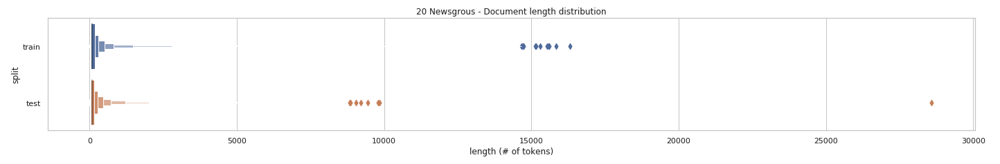

Definition {#sec:definition}
==========

Project Overview
----------------

atural Language Processing (NLP) is the sub-field of AI (Artificial
Intelligence) that is focused on enabling computers to understand and
process human languages. Text classification is one of the tasks within
the NLP domain, and it is about applying Machine Learning to assign a
category to each document in a corpus. Traditionally, the task of
classifying text with Machine Learning models has been carried out by
applying non-deep-learning classifiers, e.g., very commonly Support
Vector Machines and Naïve Bayes classifiers, and based on an approach
that disregards text sequence structure and treats each document as a
“bag of words”. Each document is thus encoded as a sparse vector in a
high dimensional space, possibly using refinements in the encoding as
TFIDF (Term Frequency Inverse Document Frequency). See [@Provost],
chapter 10: “Representing and Mining Text”.

Newer methods for text classification in the context of NLP have been
based on application of deep learning, i.e., deep neural networks. The
most natural approach has been to apply Recurrent Neural Networks (RNN),
with refined variants as Long Short-Term Memory (LSTM) and Gateway
Recurrent Units (GRU) [@Chollet]. These ones seemed better suited to the
task as they deal naturally with the input as a sequence. However,
recent experiments have shown that another variant of neural networks,
Convolutional Neural Nets (CNN), which have been applied with success to
image classification, have shown promising results for text
classification with relatively simple architectures. That is the case of
[@Kim], where a simple CNN is applied to obtain state-of-the-art scores
on different datasets. Related research followed this paper and in
[@Zhang] the authors compile the research so far and try to give a set
of guidelines for practitioners to fine-tune the multiple parameters
involved in such a CNN architecture. In this project we will use that
document as a reference and guide to build our own text CNN-based
classifier.

On the other hand, these methods for text classification based on neural
networks, both RNN and CNN, require each document to be encoded not as a
single vector that represents a whole document (like in the mentioned
TFIDF approach) but as a sequence of vectors, each one representing a
word or token. The simplest approach is to encode each word as a sparse,
high-dimensional *one-hot* vector. However, current solutions try to
transform that high-dimensional, inefficient encoding into a dense,
low-dimensional space which in turn tries to encode semantic meaning in
the distances and angles between vectors. These representations for text
tokens are called *word embeddings*. See [@Chollet], chapter 6: “Deep
learning for text and sequences”. The most representative and currently
used implementation of *word embeddings* are *word2vec* [@word2vec] and
*GloVe* (Global Vectors for word representation) [@Pennington]. In the
context of this project we will resort to the latter.

As for the types of dataset on which text classification techniques are
applied, it is interesting to note that the most studied case is
sentiment analysis, when a label of value positive or negative (and
possibly neutral too) is assigned to each document. However, the
experiments with multi-class datasets are less common. As an example,
see the cited paper [@Zhang] where 9 datasets are used but only one
dataset (TREC) is a proper multi-class dataset. We find that there may
be interesting multi-class text classification cases beyond sentiment
analysis. E.g., posts in social networks where we would like to assign a
political ideology or purchasing power to a user from the way they use
the written language in such a context. In this kind of example, we
could target specific ad campaigns to selected groups of users. That
would be something similar to the case of Facebook/Cambridge Analytica
[@Smith] but using text posted by the users to the social network
instead of their “likes”. On top of all above, we find interesting to
research how important in a text the information that can be extracted
from the sequential structure (positional information) is, compared to
the information that is available from the simple fact that a specific
set of words is used. In many cases we may assume that most of the
information is available simply from word presence, i.e., the vocabulary
that is used. Thus, the question arises: is it worthy to try to extract
additional information from text sequence structure when it means to
resort to more complex and resource-expensive models?

Problem Statement
-----------------

### Goal and justification

In this project we apply a relatively simple convolutional neural net
(CNN) as described in the recent cited papers [@Kim; @Zhang] to the
supervised problem of multi-class text classification. Allegedly, CNNs
can extract patterns from the sequential structure of text and are able
to use this to improve classification scores.

In addition, we analyze and reflect on how much of the performance of
the CNN-based classifier can be attributed to exploiting the sequential
structure of the text in comparison to the selection of the vocabulary
(set of words in each document). In other words, we try to quantify how
important sequential information is in comparison with information that
is also present in the text but is not positionally encoded. [^1]

We believe our approach is interesting at least for the following two
reasons:

-   Text classification studies for multi-class data sets are not that
    common.

-   As presented in the references above, it is assumed that CNNs may
    work well for classifying text as they can potentially extract
    sequential patterns from text (as RNNs do), but reference studies do
    not try to quantify how important this positional information is in
    the overall performance of the model.

### Dataset

In order to implement our multi-class classification scenario we resort
to a standard, well-known dataset: *20 Newsgroups* [@20Newsgroups]. The
*20 newsgroups* dataset comprises around 18,000 newsgroups posts on 20
topics split in two subsets: one for training (development) and the
other one for testing (performance evaluation).

### Strategy

We apply a variation of the convolutional-single-layered type of CNN
proposed in [@Kim] and [@Zhang]. We refer to it as **Model A**, and is
made up of the following layers, in order: embeddings, convolutional
layer (of single filter size), max pool layer, and finally a densely
connected layer of 20 nodes. We train this model and search for best
hyper-parameters. Then we evaluate how good this model is for the
classification task on the *20 Newsgroups* dataset. Then, in order to
explore and try to assess how much information relevant to the
classification task is extracted from the positional information of the
text sequences, we build and train two trimmed-down models by slightly
modifying the original one and making sure that, by design, they are not
able to extract positional information from text sequences:

-   **Model B**. It has the same components and layers of **Model A**,
    but the filter size of the convolutional layer is set to 1. This
    way, the convolutional scan won’t be able to extract sequential
    patterns from the text.

-   **Model C**. We remove the convolutional and max-pool layers from
    **Model A** and substitute them for a layer that calculates the
    average vector of the vector sequence that represents a document.
    This way we also eliminate any mechanism that could extract
    information from word positions in the text sequence.

Finally, as a benchmark model, we build **Model D**, which tackles the
task of classifying the dataset by using TFIDF (Term Frequency Inverse
Document Frequency) representation of the documents and a Multinomial
Naïve Bayes classifier.

Table \[tab:models\] and Figure \[fig:models\] summarize the models
described above with their respective layers.

{width="\linewidth"}

Metrics
-------

We assess the performance of all the models by calculating and comparing
their *accuracy*. We also use (validation) accuracy as the loss function
when training our neural network models.

$$\label{eq:accuracy}
    Accuracy = {TP + TN \over N}$$

Where *TP* is the number of true positives in the confusion matrix of
the predictions for the test dataset, *TN* the number of true negatives,
and *N* the total number of samples in the test split of the dataset.

In order to quantify how much relevant information we can additionally
extract between models, we resort to calculate the *information gain*.
This magnitude, measured in bits, tells us how much more relevant
information can a (better) model extract in comparison to another one.
Following the design of the models explained above, we know that the
only model that can extract positional information from text sequences
is **Model A**, while both **Model B** and **Model C** can not. Thus, we
assume we are able to estimate how good **Model A** in extracting such
additional positional information, by comparing its results to those of
**Model B** *which we craft to be as similar as possible to Model A but
preventing it from learning text sequence patterns*.

In order to calculate the *information gain* between two models, we need
to calculate first the *entropy* of the original test dataset and also
of the confusion matrices that result from applying the trained
classifiers to the same dataset.

The expression of *entropy* for a multi-class dataset is:

$$\label{eq:entropy1}
    H = - \sum_{i=1}^{N}  p_i \log_2(p_i)$$

where $ p_i $ is the proportion or relative frequency of each class in
the dataset and $ N $ the number of classes. In tune with this, the
expression of the *entropy (H)* for a set of samples that are classified
with the same label is:

$$\label{eq:entropy2}
    H(X|y \in Y) = - \sum_{x \in X} p(x|y) \log_2 p(x|y)$$

Where $ X = \{ x_1, x_2, ..., x_N\} $ is the set of real classes the
documents belong to and $ Y $ the set of labels (i.e., to which classes
the documents are assigned after classification). Thus, $ p(x|y) $ is
the conditional probability that a document assigned to class *y* after
classification really belongs to class *x*.

The resulting *entropy* for the complete dataset after classification is
the weighted average of the *entropies* for each label:

$$\label{eq:entropy3}
    H(X) = \sum_{y \in Y} p(y) \space H(X|y)$$

Finally, the *information gain* is calculated by subtracting the
*entropy* of the resulting classification for a model from the entropy
of the (test) dataset.

$$\label{eq:infogain1}
    IG(A) = H(X) - H_A(X)$$

Where $ IG(A) $ is the *information gain* that **Model A** gives over
the test dataset. We can also consider *information gain* between
models:

$$\label{eq:infogain2}
    IG(A,B) = H_B(X) - H_A(X)$$

Where $ IG(A,B) $ is the *information gain* that **Model A** gives over
**model B**.

See [@Provost], chapter 3, where this definition of *information gain*
is presented. Alternatively and equivalent to *information gain*, we can
calculate the *mutual information* between predicted labels and real
classes [@MI]:

$$\label{eq:mutualinfo}
    I(X;Y) = \sum_{x \in X} \sum_{y \in Y} p(x,y) \log_2 \Big( {p(x,y) \over  p(x)p(y)} \Big)$$

Analysis
========

Data Exploration
----------------

We implement our model and analysis on the multi-class dataset *20
Newsgroups* [@20Newsgroups]. This dataset can be directly imported from
the Scikit-Learn [@Sklearn] library and comprises around 18000
newsgroups posts on 20 topics split in two subsets: one for training
(development) and the other one for testing ( performance evaluation).
The split between the train and test set is based upon messages posted
before and after a specific date. The test split accounts for
approximately the 40% of the dataset. The exact proportions are
summarized in Table \[tab:traintestsplit\].

### Class distribution

The 20 labels in the *20 Newsgroups* dataset are the following:

[2]{}

1.  alt.atheism

2.  comp.graphics

3.  comp.os.ms-windows.misc

4.  comp.sys.ibm.pc.hardware

5.  comp.sys.mac.hardware

6.  comp.windows.x

7.  misc.forsale

8.  rec.autos

9.  rec.motorcycles

10. rec.sport.baseball

11. rec.sport.hockey

12. sci.crypt

13. sci.electronics

14. sci.med

15. sci.space

16. soc.religion.christian

17. talk.politics.guns

18. talk.politics.mideast

19. talk.politics.misc

20. talk.religion.misc

Quoting from [@20Newsgroups], and referred to Table \[tab:groups\]:

![20 Newsgroups - Number of documents by class (training split). Entropy
= 4.314
bits[]{data-label="fig:numbyclass"}](images/chart_01.png){width="\linewidth"}

The proportion of documents by class is displayed in Figure
\[fig:numbyclass\]. According to the dataset distribution of classes and
Equation \[eq:entropy1\], the **entropy of the dataset** is **4.314
bits**, both for the training and test divisions. The entropy for a
perfectly balanced dataset of 20 classes would be 4.322 bits, less than
0.2% away from the entropy of our dataset. Thus, we can say we have a
fairly *balanced dataset in terms of class distribution*.

### Document structure

The content of the documents is that of an e-mail. Thus, in addition to
the body of the message, we have a header, and possibly footer and
inline quotes. As pointed out in the the Scikit-learn documentation
[@Sklearn], headers, footers and quotes make the classifier to easily
overfit and learn helpful patterns that do not reside in the body of the
message. For that reason, we will remove them. Quote from Scikit-learn
documentation:

    From: mwbg9715@uxa.cso.uiuc.edu (Mark Wayne Blunier)
    Subject: Re: 5W30, 10W40, or 20W50
    Organization: University of Illinois at Urbana
    Lines: 12

    zowie@daedalus.stanford.edu (Craig "Powderkeg" DeForest) writes:

    >If you're planning on making long drives, the 20W50 is probably fine
    >(esp. in the summer) in your 10W40 car.  But if you're making short drives,
    >stick to the 10W40.

    Several years ago GM was having trouble with the rings sticking on the
    5.7 diesel.  They traced a cause to the use of 10W-40 oil.  They would
    not honor warranty work if 10W-40 was used (if my memory serves me).
    5-30, 10-30 or 20 50 was OK'd though.

    Mark B.

\[doc1\]

    Several years ago GM was having trouble with the rings sticking on the
    5.7 diesel.  They traced a cause to the use of 10W-40 oil.  They would
    not honor warranty work if 10W-40 was used (if my memory serves me).
    5-30, 10-30 or 20 50 was OK'd though.

\[doc2\]

In Figure \[doc1\] a document from the training set, index=201, is
shown. The same document with headers, footers and quotes removed, in
Figure \[doc2\].

### Text length distribution

Document length statistics for the training, test and combined datasets
are shown in Table \[tab:doclength\]. In Figure \[fig:doclength\] we use
a **letter-value plot** [@letter-value-plot] to depict length
distribution of both training and test datasets. We find this kind of
visualization to be a better option to spot outliers in our dataset than
Tukey’s box-plot. As stated in [@letter-value-plot]:

From Figure \[fig:doclength\] we notice 20 outliers in the training
dataset, all of them longer than 10,000 tokens. We carried out visual
inspection of each of them and found out that three of them were
transcriptions of long documents while the other 17 were multi-part
multimedia embedded messages. As the proportion of these kind of
documents is very small, we preferred to preserve the integrity of the
dataset and not perform any kind of document removal.

{width="\linewidth"}

### Conclusions about the dataset

Our dataset is a well-known example of multi-class classification, with
a fairly high number of classes (20). While classes are very balanced in
terms of proportions, document lengths vary a lot, from empty documents
to 28,592 tokens, approximate mean of 198 tokens, and a large standard
deviation of 707 tokens. In our investigation we need to consider a
maximum length to truncate the documents so that they retain enough
information for the classification purpose but they do not overload the
expensive computation that is required to train the CNN. The chosen
length we decide to truncate documents to is *1,000 tokens*, as only a
fairly small proportion, *only 2.4% of the documents of the training
dataset, are longer*.

Algorithms and Techniques
-------------------------

As mentioned, we built four models. We describe them in more detail now.

### Models

{width="\linewidth"}

{width="\linewidth"}

{width="\linewidth"}

**Model A** is displayed in figure \[fig:modelA\]. Its first layer is a
*tokenizer*, which converts each text document into sequences of
integers where each number represents a word in a dictionary that
contains all the words that are present in the corpus. The next layer,
*embeddings*, converts each number within a sequence into a dense vector
of 100 dimensions. The output is then a sequence matrix which has as
many rows as tokens in the document and as many columns as dimensions in
the embeddings representation. Then, a *convolutional layer* of
dimension 1 is applied to the sequence matrix. The size of the filters
is the main hyper-parameter to explore, from 2 to 9, trying to detect
which size is able to achieve better classification results. We also
explore the best number of filters to use in this convolutional layer.
The outcome of this stage is a set of *feature maps*, one per filter,
each one being a sequence of values with same length as the original
text sequences. After that, a *global max. pooling layer* reduces each
feature map to a single value. All these values coming from reducing
feature maps are then concatenated to form a vector of length equal to
the number of filters. Finally, a *dense neural net layer* of 20 nodes
with softmax activation function and some regularization (dropout and
norm constraint) is applied to get the final array of 20 values which
represent the probabilities the document has to belong to each one of
the 20 categories of the dataset.

We follow the guidelines in [@Zhang] for this type of CNN architecture
and use the same recommended starting values for model hyperparameters,
shown in Table \[tab:hparams\], although with a couple of changes:

-   Instead of *word2vec*, we use *GloVe* embeddings.

-   In [@Zhang] they propose 3 parallel channels in the convolutional
    layer, with 3 different consecutive filter sizes. We simplify the
    architecture by using a single convolutional channel with a unique
    CNN filter size; and in order to compensate model complexity and
    pattern recognition power, we multiply by 3 the number of feature
    maps we use as starting point.

**Model B** is the result of modifying **Model A** by setting the
convolutional filter size to 1. **Model C**, displayed in figure
\[fig:modelC\], is the result of modifying Model A by removing the
convolutional layer and substituting the global max. pooling layer by a
global average layer. **Model D**, depicted in figure \[fig:modelD\], is
the baseline benchmark model, which is based on a Multinomial Naïve
Bayes classifier applied on a TFIDF (Term Frequency - Inverse Document
Frequency) representation of each document.

### Libraries

In order to implement, train and evaluate our models, we used Python 3
and two main libraries:

-   **Keras** [@Keras], used to implement the neural network models (A,
    B and C) and also to pre-process the dataset (tokenizer).

-   **Scikit-Learn** [@Sklearn], used to load the *20 Newsgroups*
    dataset and also to implement the baseline model (Naïve Bayes
    classifier).

### Computing environment

Due to the high demand of processing resources associated to training
deep neural networks, we wrote and executed our code in **Google Colab**
using a notebook connected to a GPU-enabled python kernel.

Benchmark
---------

Our benchmarking strategy is based on comparing the scores we get for
the 4 proposed models.

-   *Accuracy*. We compare the final accuracy of models A, B, C and D on
    the test dataset.

-   *Information Gain*. We assess the *information gain* of each model
    in comparison with the *entropy* of the test dataset. This is
    equivalent to calculating the *mutual information* of the resulting
    classification (i.e., of the confusion matrix after evaluating each
    model on the test dataset).

Our initial assumption is that models A, B and C should be significantly
better than Model C regarding *accuracy* and *information gain*, as
their complexity is much higher. On top of this, if scores for Model A
turned out to be significantly better than for Model B, then we would
have some basis to say that Model A is managing to extract some
additional *positional* information from the dataset, as the latter was
conceived to be as similar to the former as possible except for the fact
that, due to its convolutional filters of length 1, it cannot extract
positional information. Finally, evaluating Model C and comparing it to
Model B could give us a measure of how much good a convolutional layer
does when extracting non-positional information compared to the
contributions of the embeddings and dense layers.

Methodology
===========

Data Preprocessing
------------------

### Load dataset

The *20 Newsgroups* dataset was loaded by using the utility function
`fetch_20newsgroups` provided by the Scikit-learn library, both for the
training and test splits. We removed headers, footers and quotes by
specifying the parameter `remove` of the `fetch_20newsgroups` function:

``` {.python language="Python"}
from sklearn.datasets import fetch_20newsgroups
dataset_train = fetch_20newsgroups(subset='train', remove=('headers', 'footers', 'quotes'))
```

### Document tokenization {#sec:tokenization}

The next step was tokenizing the documents in the corpus. For that
purpose we used the `Tokenizer` class in the Keras library. In the
tokenizing process we considered only the **10,000 most common words**
in the dataset. Then, we built several matrices that worked as inputs
and target outputs for our models:

-   `X_tfidf_train`. Each row in this matrix represents a document in
    the training dataset, encoded with the TFIDF method. Each column
    represents a word in the set of 10,000 most common words in the
    dataset.

-   `X_tfidf_test`. Same as above but for the test dataset.

-   `X_seqs_train`. Each row represents a document in the training
    dataset, encoded as a sequence of integers (each value corresponds
    to a word in the set of most common 10,000 words). In order to have
    constant length rows, these sequences were padded with zeros on the
    left, and truncated to the **maximum length of 1,000 words**.

-   `X_tfidf_test`. Same as above but for the test dataset.

-   `Y_train`. Matrix of integers that represents the labels (classes)
    for each document in the training dataset.

-   `Y_test`. Same as above but for the test dataset.

-   `Y_1hot_train`, `Y_1hot_test`. 1-hot encoding representation of both
    label matrices above, needed for calculating categorical
    cross-entropy (loss) when training and evaluating the neural network
    models.

### Word embeddings layer

We downloaded the *GloVe* pre-trained word vectors [@Pennington] from
*GloVe: Global Vectors for Word Representation* web page:
<https://nlp.stanford.edu/projects/glove/>. Details of the file:
Wikipedia 2014 + Gigaword 5 (6B tokens, 400K vocab, uncased, 50d, 100d,
200d & 300d vectors, 822 MB download). We took the vector representation
that use **100 dimensions** and built an embedding matrix that was to
pre-loaded in our neural network models (A, B and C).

Implementation {#sec:implementation}
--------------

The implementation process followed these steps:

1.  Hyperparameter exploration and training of **Model A**

2.  Training of **Model B** (inheriting best hyperparamter values from
    Model A)

3.  Training of **Model C** (inheriting best hyperparamter values from
    Model A)

4.  Hyperparameter exploration and training of **Model D**

5.  Evaluation of models and score comparison

### Hyperparameter exploration and training of Model A {#sec:trainingmodelA}

Table \[tab:explorationgrid\] shows the hyperparameters and values we
explored when training Model A. According to this table, we considered 6
hyperparameters and a total of 2048 combinations, an overwhelming number
for a neural network to be trained even with the support of GPUs. Thus,
we decided to divide the exploration in three phases. Keeping in mind
that the most relevant hyperparamters in our investigation are
*convolutional filter size* and *number of convolutional filters*, we
left the exploration of these two to the final phase. In each phase we
performed a grid search only for two selected hyperparameters, as
follows:

1.  First, we tried to find the best hyperparameter values for *batch
    size* and *optimizer type*, leaving the rest of hyperparameters
    fixed to the values suggested as starting point in Table
    \[tab:hparams\]. We performed a grid search and trained Model A with
    all the hyperparameter combinations shown for this phase in Table
    \[tab:explorationgrid\]. We picked the best combination according to
    the best *validation accuracy* obtained in the process.

2.  Then, we fixed the best values we found for *batch size* and
    *optimizer type* and explored the effect of preloading the embedding
    layer with the GloVe word vectors, and if the weights of the
    embedding layer should be optimised during training or left as they
    had been pre-loaded. Again, we trained Model A with the 4
    combinations and selected the best one according to the best
    validation accuracy.

3.  After that, we fixed the values for both hyperparameters *embedding
    preload* and *embedding train* and then explored the *convolutional
    filter size* and *number of filters* in the convolutional layer. We
    scanned values from 2 to 10 for the convolutional filter size, and
    tried number of filters 100, 300, 600 and 900.

After the exploration process we had found a final combination of
hyperparameters from all the possibilities shown in Table
\[tab:explorationgrid\], and could finally train Model A with it. We
saved the best found configuration for Model A and the computed model
weights so that we could recreate a trained instance of the model
without further training.

### Training Model B

We created then an instance of Model B by inheriting the best
combination of hyperparameters from Model A, but changing the value of
*convolutional filter size* to 1. As explained, we wanted to force the
new model not to be able to extract positional information from the text
sequences while being very similar to Model A. We trained this instance
of Model B and also saved the resulting weights.

### Training Model C

In a similar way, we created a new instance of a neural network, but
this time by modifying Model A and removing the convolutional layer and
substituting the *global max pooling layer* with a *global average
pooling layer* (figure \[fig:modelC\]). Again, we re-used the best
hyperparameter values we found for Model A except for *convolutional
filter size* and *number of convolutional filters*, which were not
applicable anymore. We trained this instance of Model C to get and save
its weights.

### Number of epochs

While carrying out the hyperparameter exploration process to pick the
best hyperparamter combinations we always used the same number of
epochs, 20, in order to train the convolutional neural net. We wanted to
keep it to a small value to save computing resources and time. However,
once the hyperparamter selection was done and we went on to training the
final instances of models A, B and C, we had to check in each case if
the number of epochs was enough for the validation accuracy to reach a
stable *plateau* through epochs (Figure \[fig:epochs\]). Considering
this, we decided to train models A and B along 30 epochs, and we had to
increase that value to 1,000 epochs for Model D.

  ------------------------------------------------------- -------------------------------------------------------
   {width=".502\linewidth"}   {width=".498\linewidth"}
  ------------------------------------------------------- -------------------------------------------------------

### Hyperparameter exploration and training of Model D

Finally, we trained the baseline benchmark model, a Multinomial Naïve
Bayes classifier applied on TFIDF document representations. The
simplicity of the model led us to only explore hyperparameter *alpha*
(additive Laplace/Lidstone smoothing parameter [@Sklearn]) from 0.1 to
1.0 in 0.1 steps. The model trains and runs pretty fast so we decided
not to save its trained weights in a file.

### Model evaluation

After hyperparameter exploration and model training, we went on to model
evaluation. We created new fresh model instances with the hyperparamter
values that resulted from our exploration process. We loaded the
serialized weights from files into each model instance. Then, we
proceeded to calculate the scores *accuracy* and *information gain* for
each model. In order to calculate accuracies we did the following:

-   For models A, B and C (based on Keras) we applied the Keras method
    `model.evaluate(X_seqs_test, Y_1hot_test)`. Refer to matrix
    definitions in \[sec:tokenization\].

-   For Model C (based on Scikit-learn) we applied the Scikit-learn
    method `model.score(X_tfidf_test, Y_test)`.

In both cases, and “under the hood”, the model was applied to obtain
prediction matrices, counts of true positives and true negatives were
carried out and, after that, Equation \[eq:accuracy\] was applied. Then,
for calculating the *information gain* we followed these steps:

1.  We applied each model to the input matrix for the test dataset
    (`X_seqs_test` for models A, B and C; `X_tfidf_test` in the case of
    model D). The predicted values were converted from 1-hot to
    categorical encoding and stored in matrices `Y_predictionA`,
    `Y_predictionB`, `Y_predictionC`, and `Y_predictionD`.

2.  From these output matrices we calculated the corresponding confusion
    matrices by applying the Scikit-learn function
    `confusion_matrix(Y_test, Y_prediction)`. See a sample of the
    confusion matrices for our 4 models visualized in figure
    \[fig:confusionmatrix\].

3.  From the confusion matrices, we calculated the *information gain*
    using Equation \[eq:infogain1\] (alternatively and equivalently the
    *mutual information*, Equation \[eq:mutualinfo\], can be used).

  ------------------------------------------------------ ------------------------------------------------------
   {width=".50\linewidth"}   {width=".50\linewidth"}
  ------------------------------------------------------ ------------------------------------------------------

After this process we were ready to compare our scores, *accuracy* and
*information gain*, obtained for our models A, B, C and D. However,
before going into any meaningful evaluation of results, we needed to
make some refinements related to variance. Altough we got through the
first iteration of the presented process without such a concern, we were
aware that both the hyperparameter exploration and final model training
have stochastic components, and therefore our results could
significantly change (as in fact they did) if we executed the
exploration and training phases different times. Randomness comes in
from two different sources along this process:

-   The neural network training process has elements that are stochastic
    by nature, e.g., weight initialisation, dropout regularisation,
    optimisation, etc.

-   The cross-validation process can also introduce randomness if there
    is shuffling involved. That is the case for our Naïve Bayes
    classifier, for which we used shuffled cros-validation
    (`sklearn.model_selection.ShuffleSplit`).

Quoting [@Zhang], in section 5.2 giving “specific advice to
practicioners”:

Refinement {#sec:refinement}
----------

Thus, we repeated the whole process but **including variance** in the
analysis. First, in the hyperparameter selection process, we repeated
the training session **5 times** for each hyperparamter combination and
*we considered a **confidence level of 95%** and confidence intervals of
validation accuracy values to make decisions about best hyperparameter
combinations*. And then, once the best hyperparameter combination was
selected, we ran the final training session **10 times** for each model
and again we compared the resulting values for *accuracy* and
*information gain* taking confidence intervals into account with the
same alluded confidence level. In section \[sec:results\] we bring all
this up together.

Results {#sec:results}
=======

Model Evaluation and Validation
-------------------------------

In table \[tab:besthyperparams\] we summarize the best hyperparameter
values for our models A, B, C and D after the hyperparameter exploration
process. For getting the best hyperparamter combination for Model A we
followed the process described in section \[sec:trainingmodelA\]. The
first step of the phased grid search was about finding the best
optimizer and batch size. In Figure \[fig:explorationphase0\], left
side, we visualize the validation accuracies for the considered
optimizers (rmsprop, adagrad, adam, nadam) and batch sizes (64, 128, 256
and 512). The figure shows that the best combination seems to be for the
**nadam** optimizer and batch size of **128**. However note that the
confidence interval (95%) of this combination overlaps with the ones for
(nadam, 64) and (nadam, 256). We chose the combination (nadam, 128) as
the most likely best one, but we cannot affirm that assuming our
confidence level of 95% this selection of hyperparamter values is better
than the other two. In the second phase of the exploration, with
optimizer and batch size fixed to (nadam, 128), we explored the
embeddings layer. Figure \[fig:explorationphase0\], right side, shows
the results for the two related hyperparamters. This time the confidence
intervals (95%) are pretty narrow and do not overlap. Thus, we were
quite confident to choose preloading the *GloVe* embedding vectors and
also training the pre-loaded embeddings layer as the best option. The
third phase of the hyperparamter exploration is the most interesting one
as it deals with number and size of convolutional filters, which is
where the ability to extract positional information is. In figure
\[fig:explorationphase1\], left side, we note that the best mean for
validation accuracy is above 0.72 and corresponds to a filter size 3 and
900 feature maps. However, its 95% confidence interval overlaps with two
other combinations of size and number of filters: (2,900) and (2,600),
both of which have slightly lower validation accuracy means. We
performed a 2-tailed t-test for combinations (3,900) and (2,600) to
confirm our reasoning and it yielded a p-value of 0.3539, which is much
greater than our significance level of 0.05. Thus, we can say that we
had no solid base to decide which one of the 3 best combinations is
better. **For this reason we chose filter size of 2 and 600 feature
maps, as fewer number of filters of smaller size are expected to build a
model that is less complex, therefore a model that is faster to train
and less prone to overfitting**. We applied a similar method when
exploring the *alpha* hyperparameter of Model D and chose 0.8 as its
value because, although we got overlapping confidence intervals, it
yielded the highest validation accuracy mean.

  ------------------------------------------------------- -------------------------------------------------------
   {width=".497\linewidth"}   {width=".503\linewidth"}
  ------------------------------------------------------- -------------------------------------------------------

  ------------------------------------------------------- -------------------------------------------------------
   {width=".499\linewidth"}   {width=".501\linewidth"}
  ------------------------------------------------------- -------------------------------------------------------

Justification {#sec:justification}
-------------

After selecting the best hyperparameters, we went onto the process of
training and evaluating each model, 10 repetitions each, to deal with
variance due to stochastic processes in training and cross-validation as
explained in section \[sec:refinement\]. The results are visualized as
confidence intervals in Figure \[fig:scores\], both for *accuracy*
(left) and *information gain* (right). From this figure and from Table
\[tab:results\], which lists the means for accuracy and information
gain, we can make the following observations:

-   Model A shows the best results, both for *accuracy*, 67.1%, and
    *information gain*, **2.342 bits** (to be subtracted from the
    original entropy of the dataset, 4.314 bits).

-   Model C shows the worst score, as expected. *Accuracy* of 63.3%
    (3.8% worse than Model A), and *information gain*, **2.237 bits**
    (0.105 bits worse than Model A).

-   Model B and C lie somewhere in the middle both in terms of
    *accuracy* and *information gain*.

-   Within our confidence level (95%) we are quite confident that Model
    A is significantly better than the rest of them, and that Model D is
    significantly worse. See how their confidence intervals (A and D) do
    not overlap with any other model.

-   Within our confidence level, we cannot affirm that model B is better
    than C nor C better than B. Whereas for information gain the
    confidence intervals do not overlap, for accuracy they do.

-   We formalized the observations above by performing a 2-tail t-test
    for all possible model combinations. Figure \[fig:pvalues\] shows
    the p-values we obtained. Observe how the only case in which the
    p-value is higher than the significance level (0.05) is the
    combination of models B and C, for which the p-value is 0.11
    (greater than 0.05). Therefore we cannot reject the *null
    hypothesis* in this case and cannot say that any of the two models
    (B and C) is better than the other.

The main takeaway here is that we have proved that **our convolutional
model with 600 convolutional filters of size 2 (Model A) is not only
better than the other 3 models in terms of accuracy and information
gain, but also that we have some basis to affirm that it can extract
some additional information which is positionally encoded**, and which
the rest of the models (B, C and D) cannot extract. However, we have to
be aware according to Table \[tab:results\] that the improvement in
accuracy is around 1.3% over model B, and **the extra information over
model B is only 0.05 bits**. We see two interpretations to this:

-   either that our model is relatively good extracting positional
    information from text but there is not a lot of positional
    information to be extracted in our dataset [^2],

-   or that there is more positional information than 0.05 bits in our
    dataset but our convolutional model is not able to extract it.

  ----------------------------------------------------- -----------------------------------------------------
   {width=".5\linewidth"}   {width=".5\linewidth"}
  ----------------------------------------------------- -----------------------------------------------------

{width=".9\linewidth"}

{width=".7\linewidth"}

Conclusion
==========

Reflection
----------

In this investigation we built a multi-class text classifier based on a
convolutional neural net (CNN), tried to find an optimal configuration
for it (which turned out to be 600 convolutional filters of size 2 and a
trainable embeddings layer pre-loaded with *GloVe* vectors of 100
dimensions), and trained it to classify documents of the *20 Newsgroups
dataset*. Then we compared its performance with two different carefully
trimmed-down versions of itself which by design were not able to extract
positional information from the documents. Our results confirmed that
our CNN model can extract some positional information. However, we also
realized that this improvement was modest and was mainly associated to
patterns of two consecutive words (bi-grams), as models with longer
filter sizes yielded worse scores. Finally, we compared our model with a
standard Naïve Bayes classifier, which performed 3.8% worse in terms of
accuracy and 0.105 bits worse regarding information gain.

  ----------------------------------------------------- -----------------------------------------------------
   {width=".5\linewidth"}   {width=".5\linewidth"}
  ----------------------------------------------------- -----------------------------------------------------

The question arises then, if all the extra complexity an additional
resources needed by our CNN model (and even by our two trimmed-down
variants) is worth it when trying to implement them in a real production
environment. Along the training process, besides calculating scores
(accuracy and information gain), we also gathered data about the time
spent in training the model (“training time”) and the time spent in
calculating the accuracy score on the test dataset (“testing time”)
after the models were trained and loaded with the final weights. We can
use these values to compare relative training and prediction speeds
between models. See how Figure \[fig:times\] visualizes both training
and testing times versus the final accuracy score for each model and
each repetition in the evaluation process. From these figures we can
observe, without going into the detail of specific values, the
following:

-   The **fastest model to train and predict** is clearly Model D, the
    **Naïve Bayes** classifier.

-   The **convolutional models** (A,B) are **very slow to train**
    ($\sim$ 300 times slower than Model D) and **slow to predict**
    ($\sim$ 6 times slower than model D).

-   The **dense, non-convolutional model** (C), is **extremely slow to
    train** ($\sim$ 1200 times slower than Model D) but **very fast to
    predict** (almost as fast as Model D).

-   In addition we have to keep in mind that for these results, models
    A, B and C ran on GPU (Google Colab environment) and model D is
    built on top of Scikit-learn, which only runs on CPU. Thus, the
    differences between those ones and the latter must be much bigger in
    terms of computation resources usage.

The process of making a decision about which model is the best one
ultimately depends on the concrete use case, which could justify or not
the limited performance gains and the associated trade-offs in terms of
time and computation resources. If we are able to assign costs and
benefits to training and testing times, and also to true and false
positives and negatives in our classification outcome, then we could
apply the *Expected Value* framework ([@Provost], chapter 7) to find out
which model fits better our real-world scenario in terms of profits.

Finally, we would like to enumerate some interesting aspects about this
investigation that we believe are worth pointing out:

-   **Variance**. We learned that it is imperative to consider variance
    both in the hyperparamter selection process and also in performance
    assessment. We included confidence intervals in our analysis and
    visualizations, and performed t-tests and evaluated p-values in the
    critical parts. We also deemed it worthy to illustrate variance
    impact in Figure \[fig:explorationphase1\], right side, where we
    show validation accuracy trough epochs during the search for best
    filter size and number of filters. Observe how the validation
    accuracy series overlap into a blurry representation in which
    smaller filters seem to be better, but not clearly better, than the
    closest bigger ones.

-   **Processing resources**. Training, and even evaluating neural
    networks, is extremely CPU intensive and, in consequence, GPU
    support is imperative. We had to resort to working in a Google Colab
    environment backed by GPUs to make it possible. Note how the
    variance issue aggravates the problem as it entails additional
    repetitions of training sessions.

-   **Information Gain**. We proposed *Information Gain* as the second
    evaluation score, as we believed it would best fit the problem of
    quantifying extraction of positional information. In figure
    \[fig:regression\] we see how tightly correlated *accuracy* and
    *information gain* seem to be. We also calculated the Pearson’s r
    value: 0.976. We would be inclined to state that in the context of
    our problem both scores seem to be good proxies for each other.
    However, in figures \[fig:pvalues\] and \[fig:scores\] we see that
    while *information gain* could discriminate between models B and C
    with statistical significance, *accuracy* could not. We find this is
    an interesting finding to be further researched.

-   **Overfitting**. The best convolutional model in terms of
    performance turned out to be the one with the shortest filter
    size, 2. We learned that slightly longer filter sizes were not
    significantly better and that even longer filter sizes yielded worse
    scores (figure \[fig:explorationphase1\]). This can be explained if
    we assume that most of the positional information is encoded in
    bi-grams and also understanding that longer filters, even though
    they have the ability to *emulate* shorter ones [^3], may easily
    tend to overfit and learn longer patterns from the documents that do
    not generalize.

Improvement
-----------

Finally, in order to improve and continue this work, we recommend the
following lines:

-   Considering other models, arguably more suited to extract positional
    information from text, like Recurrent Neural Networks (RNN) with its
    variants GRU and LSTM [@Chollet].

-   Experimenting with more convolutional layers trying to give the
    model more abstraction power and check if that reverts into better
    ability to extract positional information.

-   Validating the proposed methodology on other datasets.

-   Considering some sort of sensitivity and robustness analysis beyond
    our variance analysis.

-   And most interestingly, trying to visualize and analyze the weights
    of the convolutional filters obtained for our Model A, and explain
    them in terms of the original vocabulary of our dataset. This way we
    may better understand the mechanisms underlying positional
    information extraction and we could also get valuable insights to
    try to validate our hypothesis that the improvement between Model A
    and B has to be mainly due to positional information.

[^1]: We are aware that the potential amount of information that is
    positionally encoded in the text depends on the type of dataset and
    its label set. Note also that when we refer to *information*, we
    mean information that is relevant to the specific classification
    task we are dealing with.

[^2]: I.e., information relevant to the classification task and specific
    dataset.

[^3]: by detecting patterns that are shorter than their length
